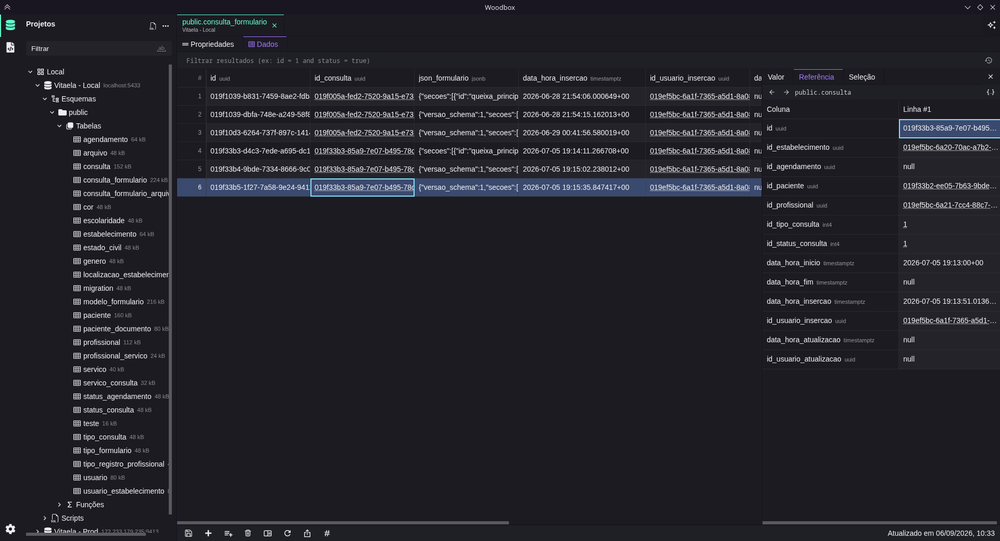
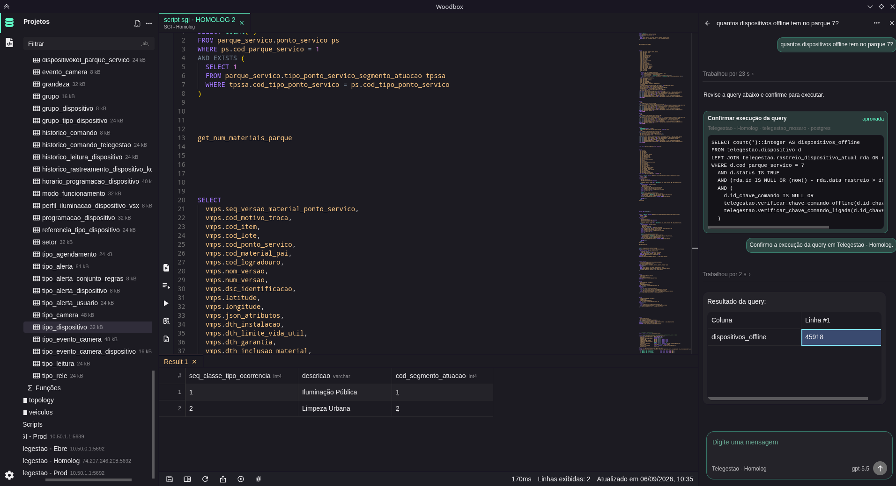
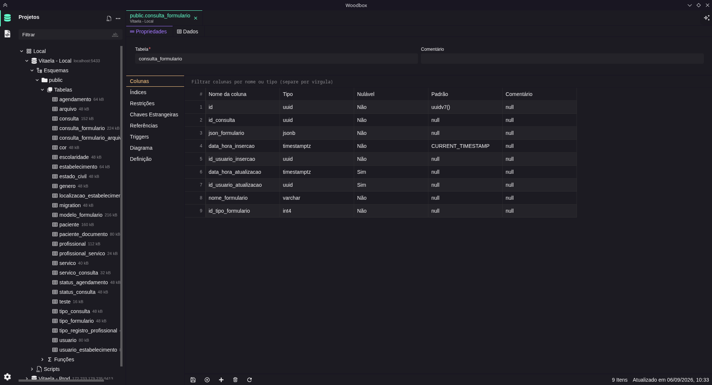
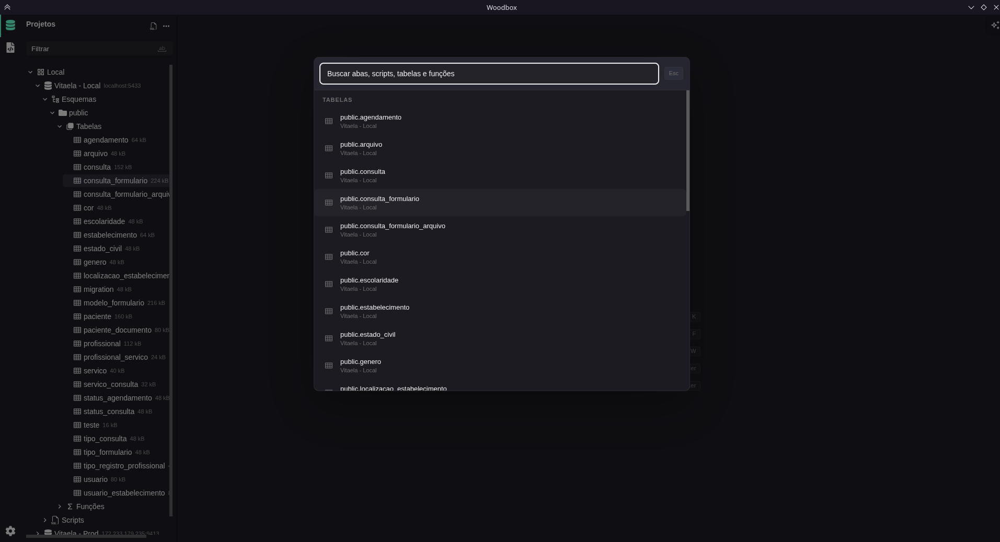

<div align="center">


# Woodbox

**Lightweight desktop database manager for PostgreSQL, MySQL and SQLite**

[](https://opensource.org/licenses/MIT)
[](https://electronjs.org)
[](https://reactjs.org)
[](https://typescriptlang.org)
[](https://www.postgresql.org)
[](https://www.mysql.com)
[](https://www.sqlite.org)
[](https://www.microsoft.com/windows)
[](https://www.linux.org)
[](https://www.apple.com/macos)

[Download](https://github.com/antonycms/woodbox/releases) · [Screenshots](screenshots) · [Report Bug](https://github.com/antonycms/woodbox/issues) · [Request Feature](https://github.com/antonycms/woodbox/issues)

</div>

---

## About

Woodbox is a desktop application for managing database connections and executing SQL queries. Organize your connections into projects, explore schemas, browse table data, and run custom queries — all from a clean, focused interface.

|  |  |
|---|---|
|  |  |
|  |  |

[View all screenshots](screenshots)

## Why Woodbox?

- **Focused desktop workflow** — Manage projects, connections, schemas, tables and queries without leaving the app.
- **SQL-first experience** — Monaco-powered editor with autocomplete, selected-query execution, snippets and query results.
- **AI-assisted querying** — Generate, explain and refine SQL with your configured provider.
- **Local-first storage** — Connections, projects, scripts, snippets and preferences are saved locally.
- **Cross-platform** — Built with Electron for Windows, macOS and Linux.

## Highlights

### Browse table data

Inspect rows, paginate results, search data and explore table structure from a focused grid interface.

### Query editor

Write SQL with syntax highlighting, autocomplete, snippets, split tabs and keyboard-driven execution.

### AI assistant

Configure AI providers and use the assistant beside the editor to draft SQL, inspect context and review query execution.

### Schema tools

Explore tables, columns, indexes, foreign keys, functions and database structure, with database comparison support.

## Supported databases

| Database | Status |
|---|---|
| PostgreSQL | Supported |
| MySQL | Supported |
| SQLite | Supported |

## AI providers

| Provider | Status |
|---|---|
| OpenAI | Supported |
| Anthropic | Supported |
| Google | Supported |
| OpenRouter | Supported |
| OpenAI-compatible endpoints | Supported |
| Codex / ChatGPT account | Supported |

## Features

- **Multi-database support** — Connect to PostgreSQL, MySQL, and SQLite
- **Project organization** — Group connections into projects for easy access
- **Schema browser** — Explore database structure, tables, columns, and foreign keys
- **Table explorer** — Browse and paginate table data
- **SQL editor** — Write and execute queries with syntax highlighting and autocomplete (Monaco Editor)
- **AI assistant** — Use configured providers to generate, explain and refine SQL
- **Snippets** — Create, import and export reusable SQL snippets
- **Query results** — View results in a rich tabular format
- **Database compare** — Compare database structures across connections
- **Persistent storage** — Connections and projects are saved locally
- **Theme support** — Switch between dark and light themes
- **Cross-platform** — Runs on Windows, macOS, and Linux

## Keyboard shortcuts

| Shortcut | Action |
|---|---|
| <kbd>Ctrl/Cmd</kbd> + <kbd>Enter</kbd> | Run current SQL |
| <kbd>Ctrl/Cmd</kbd> + <kbd>Shift</kbd> + <kbd>Enter</kbd> | Run current SQL in a new result tab |
| <kbd>Ctrl/Cmd</kbd> + <kbd>Alt</kbd> + <kbd>Enter</kbd> | Run selected SQL |
| <kbd>Ctrl/Cmd</kbd> + <kbd>Alt</kbd> + <kbd>Shift</kbd> + <kbd>Enter</kbd> | Run all SQL |
| <kbd>Ctrl/Cmd</kbd> + <kbd>E</kbd> | Explain current SQL |
| <kbd>Ctrl/Cmd</kbd> + <kbd>\</kbd> | Run current SQL in a new result tab |
| <kbd>Ctrl/Cmd</kbd> + <kbd>K</kbd> | Open central search |

## Download

Download the latest installer from the [Releases](https://github.com/antonycms/woodbox/releases) page.

## Roadmap

- SSH tunnel support
- More database engines
- Query history improvements
- Import/export connection profiles
- Packaged installers for more distribution channels

## Tech Stack

| Category | Technology |
|---|---|
| Desktop | Electron 43 |
| Frontend | React 19, TypeScript 7 |
| Build | electron-vite, Vite 8 |
| Editor | Monaco Editor |
| Database | Knex, pg, mysql2, sqlite3 |
| Storage | electron-store |

## Getting Started

### Prerequisites

- [Node.js](https://nodejs.org/) v18+
- pnpm

### Installation

```bash
git clone https://github.com/antonycms/woodbox.git
cd woodbox
pnpm install
```

### Running

```bash
# Development (with hot reload)
pnpm run dev

# Preview production build
pnpm start
```

### Building

```bash
# Build for current platform
pnpm run build

# Platform-specific builds
pnpm run build:win    # Windows
pnpm run build:mac    # macOS
pnpm run build:linux  # Linux
```

## macOS: first launch warning

The macOS build is not notarized by Apple yet because Apple requires a paid Apple Developer Program account to create a Developer ID certificate and notarize apps distributed outside the Mac App Store. Because of that, Gatekeeper may block the first launch after installation.

This is expected and only needs to be done once after installing the app:

```bash
xattr -dr com.apple.quarantine /Applications/Woodbox.app
open /Applications/Woodbox.app
```

After the first successful launch, Woodbox can be opened normally from Applications.

## Project Structure

```
src/
├── main/               # Electron main process
│   ├── database/       # DB connections and query logic
│   └── storage/        # Persistent storage (projects, connections)
├── preload/            # IPC bridge
└── renderer/           # React frontend
    └── src/
        ├── components/ # Reusable UI components
        ├── contexts/   # Global state (store, theme, tabs, toast)
        ├── views/      # Main views (TableInfo, QueryEditor)
        ├── hooks/      # Custom React hooks
        └── styles/     # Global styles and themes
```

## Scripts

| Script | Description |
|---|---|
| `pnpm run dev` | Start in development mode |
| `pnpm run build` | Build with TypeScript checks |
| `pnpm run typecheck` | Run TypeScript type checks |
| `pnpm run lint` | Lint and auto-fix with Biome |
| `pnpm run format` | Format code with Biome |

## License

[MIT](LICENSE) © [Antony Santos](https://github.com/antonycms)
