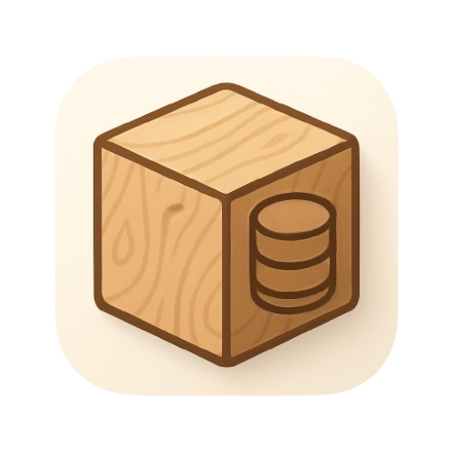

<div align="center">



# Woodbox

**A modern, cross-platform database management application**

[](https://opensource.org/licenses/MIT)
[](https://electronjs.org)
[](https://reactjs.org)
[](https://typescriptlang.org)

</div>

---

## About

Woodbox is a desktop application for managing database connections and executing SQL queries. Organize your connections into projects, explore schemas, browse table data, and run custom queries — all from a clean, focused interface.

## Features

- **Multi-database support** — Connect to PostgreSQL, MySQL, and SQLite
- **Project organization** — Group connections into projects for easy access
- **Schema browser** — Explore database structure, tables, columns, and foreign keys
- **Table explorer** — Browse and paginate table data
- **SQL editor** — Write and execute queries with syntax highlighting and autocomplete (Monaco Editor)
- **Query results** — View results in a rich tabular format
- **Persistent storage** — Connections and projects are saved locally
- **Theme support** — Switch between dark and light themes
- **Cross-platform** — Runs on Windows, macOS, and Linux

## Tech Stack

| Category | Technology |
|---|---|
| Desktop | Electron 35 |
| Frontend | React 18, TypeScript 5 |
| Build | electron-vite, Vite 6 |
| Editor | Monaco Editor |
| Database | Knex, pg, mysql2, sqlite3 |
| Storage | electron-store |

## Getting Started

### Prerequisites

- [Node.js](https://nodejs.org/) v18+
- pnpm

### Installation

```bash
git clone https://github.com/antonycms/pg-manager-react-novo.git
cd pg-manager-react-novo
pnpm install
```

### Running

```bash
# Development (with hot reload)
pnpm run dev

# Preview production build
pnpm start
```

### Building

```bash
# Build for current platform
pnpm run build

# Platform-specific builds
pnpm run build:win    # Windows
pnpm run build:mac    # macOS
pnpm run build:linux  # Linux
```

## macOS: first launch warning

The macOS build is not notarized by Apple yet because Apple requires a paid Apple Developer Program account to create a Developer ID certificate and notarize apps distributed outside the Mac App Store. Because of that, Gatekeeper may block the first launch after installation.

This is expected and only needs to be done once after installing the app:

```bash
xattr -dr com.apple.quarantine /Applications/Woodbox.app
open /Applications/Woodbox.app
```

After the first successful launch, Woodbox can be opened normally from Applications.

## Project Structure

```
src/
├── main/               # Electron main process
│   ├── database/       # DB connections and query logic
│   └── storage/        # Persistent storage (projects, connections)
├── preload/            # IPC bridge
└── renderer/           # React frontend
    └── src/
        ├── components/ # Reusable UI components
        ├── contexts/   # Global state (store, theme, tabs, toast)
        ├── views/      # Main views (TableInfo, QueryEditor)
        ├── hooks/      # Custom React hooks
        └── styles/     # Global styles and themes
```

## Scripts

| Script | Description |
|---|---|
| `pnpm run dev` | Start in development mode |
| `pnpm run build` | Build with TypeScript checks |
| `pnpm run typecheck` | Run TypeScript type checks |
| `pnpm run lint` | Lint and auto-fix with Biome |
| `pnpm run format` | Format code with Biome |

## License

[MIT](LICENSE) © [Antony Santos](https://github.com/antonycms)
